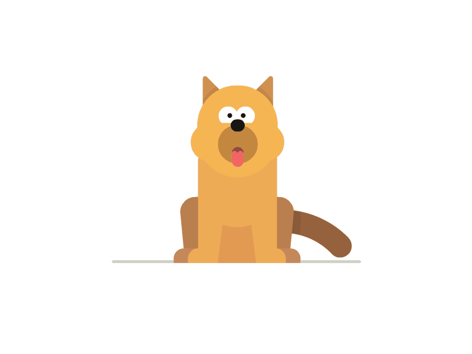
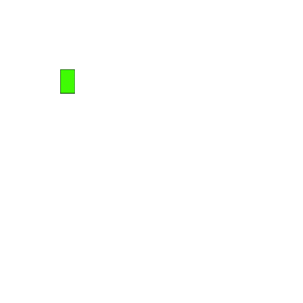

[](https://bunny77k9.github.io/)

<!------>
[](https://twitter.com/NandunDiaz)
[](https://www.linkedin.com/in/dulajdiaz/)
[](https://codepen.io/NandunDiaz)
[](https://gitlab.com/Bunny77K9)
[](https://gitlab.com/Bunny77K9)
[](https://stackoverflow.com/users/16005578/bunny?tab=profile)
[](https://www.youtube.com/channel/UCb8fmRl9WGd2K3QEsqu5wiw)


<a href="#"></a>

- 👋 Hi, I’m <b>Nandun</b>!
- 👀 I’m interested in AI, ML & Full-Stack web dev
- 🌱 I’m currently reading Software Engineering at UoW
- 👩‍💻 I’m working as a Trainee Software Engineer @IFS
- 💜 I’m looking to collaborate on open-source
- 💬 Ask me about Java, TypeScript, ML and Cloud
- 🕵️‍♀️ Pronouns: He/Him
- ⚡ Fun fact: Sometimes I confuse my <b>Doggy</b>! 😜

<h2 align="center">Watch snake-eating my contribution graph on Github 🐍</h2>

<p align="center">
<a href="https://github.com/Bunny77K9/"></a>  <!--- All credits goes to the Chamod Shehanka Perera --->
</p>

<be>

<div align="center">
  <h2><b>✨ HOLOPIN BADGE BOARD ✨</b></h2>
</div>

<br>

[](https://holopin.io/@nandx)

<br>

[](https://help.cloudsmith.io/docs/integrating-with-github-actions)

<br>

[](https://github.com/Bunny77K9/)

<br>

<p align="center">
<a href="#"></a>
<br><br>
<a href="#"></a>
<a href="#"></a>
</p>

<a href="#"></a>

``` 
  @Bunny77K9's 2020 GitHub Skyline 

                         ▁    █        ▃          █  
 ✧    ✦             ▇    █    █✦  ☽ ▂▄ █ ▇       ✧█  
  ▆  ✧   ▄ ✧  ▆ ▄   █    █ ▄  █ ▂✦▄ ██▆█ █        █  
  █▅▃▃▁ ▁█ ▃▃▅█▆█▃▃▅█▅▃ ▃█▃█▃▃█▅█▅█▆████▃█ ▃✧▅▃ ▃ █▁ 
  █▅▃▃▁ ▁█ ▃▃▅█▆█▃▃▅█▅▃ ▃█▃█▃▃█▅█▅█▆████▃█
▁▁█████▅██▅████████████▅██████████████████▅█▁██▅█▁██▁
```

<!---<a href="#"></a>--->

<!---<p width="100%">
<a href="#"></a>
</p>--->

<br>

**<p align="center"> Made with ❤ by Nandun </p>**

<p align="center">
<a href="#"></a>
</p>

<!---
Bunny77K9/Bunny77K9 is a ✨ special ✨ repository because its `README.md` (this file) appears on your GitHub profile.
You can click the Preview link to take a look at your changes.
--->
